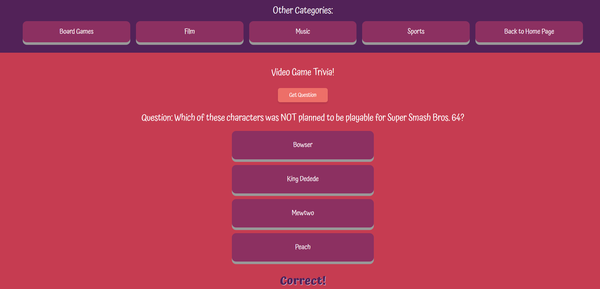

# Tricky Trivia API

Link to project: (https://trickytrivia.netlify.app/)

## How It's Made:
Tech used: HTML, CSS, JS

This application utilizies the trivia API (https://opentdb.com/) - it makes fetch requests for a random trivia question from a user specified category, and then displays it in the browser, allowing users to enjoy answering a variety of different trivia questions.

## Optimizations

Rather than having one JS file that made different fetch requests in a conditional based on the user selected category, I opted to have a different JS file for each page. This means that each file is catered to make a request for ONLY the category that corresponds to the page that the user is currently on.

## Lessons Learned

From this project, I learned that the data that is pulled from an API can sometimes be too predictable. In this case, when pulling the answers to the questions, the answer was always the first option in the array. To account for this, I decided to then sort the array alphabetically after getting it, to ensure that the correct option would not always be in the same location.

